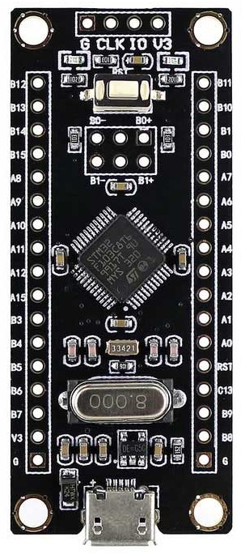
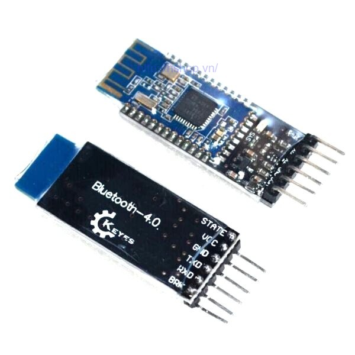
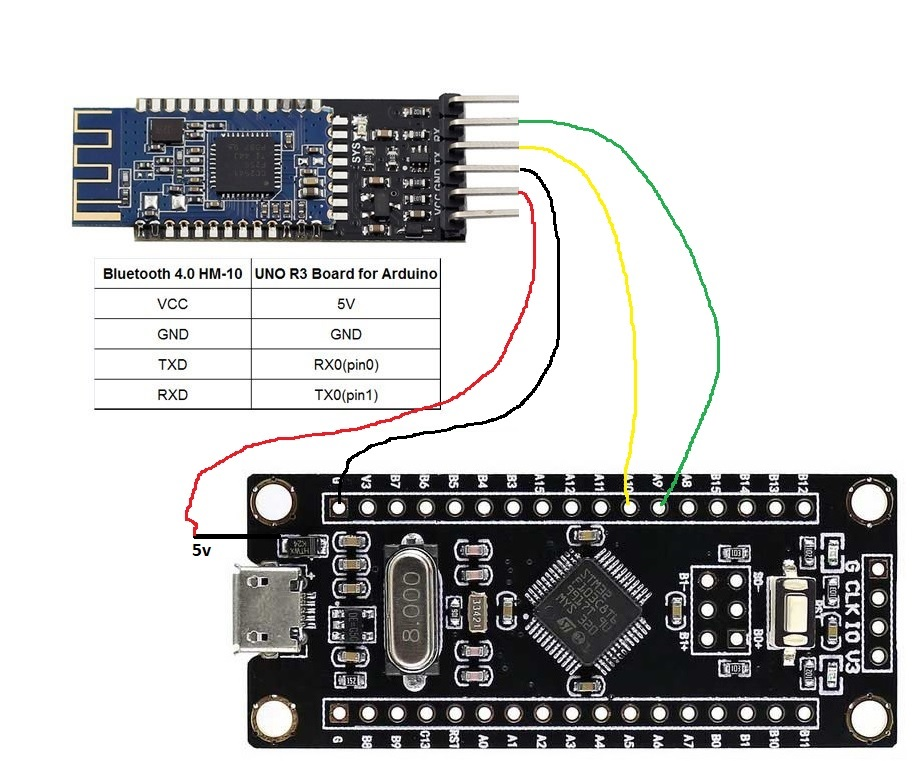
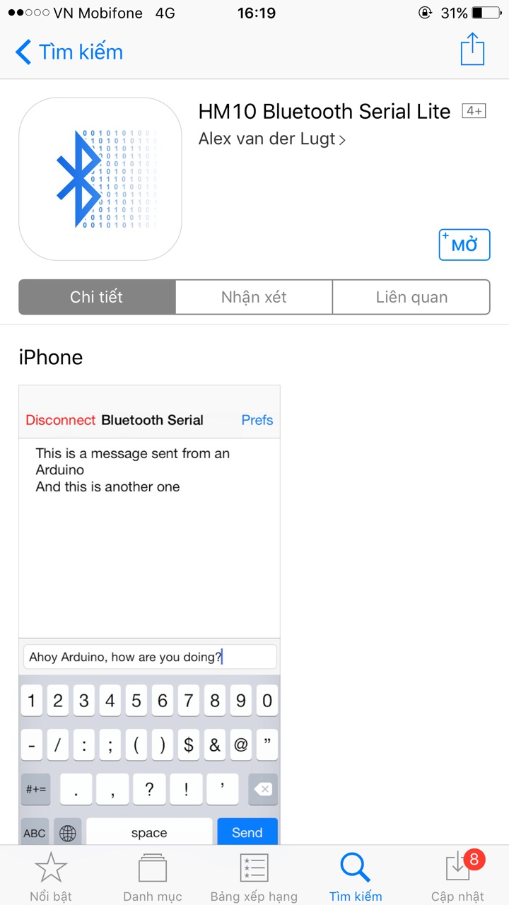
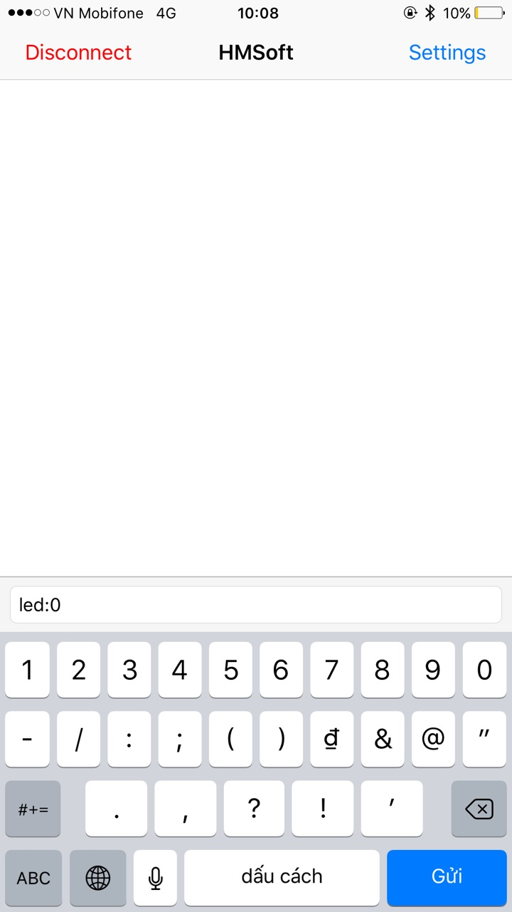
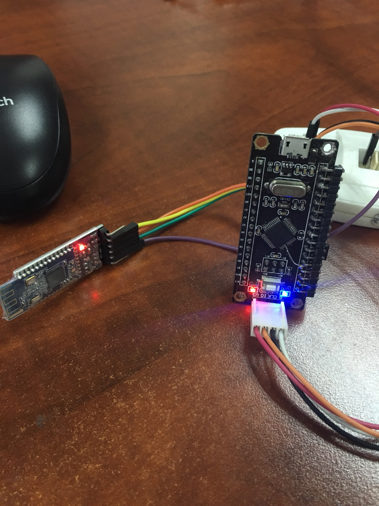

#DEMO FREE RTOS KERNEL ON STM32F103C8T6

## Overview
Demo control led on board Stm32f103c8t6 via app "Serial" on mobile. Use Free RTOS and communication protocol UART of Module Bluetooth HM-10.
## Types of Module
### STM32F103C8T6

**Basic specs**

	Brand new and high quality
	Model: STM32F103C8T6
	Core: ARM 32 Cortex-M3 CPU
	Debug mode: SWD
	72MHz work frequency
	64K flash memory, 20K SRAM
	2.0-3.6V power, I/O
	4-16MHz crystal
	Size:5.3cm x 2.2cm
### Bluetooth 4.0 UART CC2541 HM-10

**Basic specs**

	+2.5v to +3.3v
	Requires up to 50mA
	Uses around 9mA when in an active state
	Use 50-200uA when asleep
	RF power: -23dbm, -6dbm, 0dbm, 6dbm
	Bluetooth version 4.0 BLE
	Default baud rate for the serial connection is 9600
	Default PIN is 000000
	Default name is HMSoft
	Based on the CC2540 or the CC2541 chip

## Hardware & Tools
### Hardware
#### STM32F103C8T6

#### Connect STM32F103C8T6 Module to HM-10

### Tools
#### Keil C v5 for arm
##### Step 1: Install IDE
	

	Link install IDE: 	http://www2.keil.com/mdk5
##### Step 2: Install Package for IC
	

	Link install Package for IC:	http://www.keil.com/dd2/Pack/
##### Step 3: Download Libary STM32F1
	https://github.com/svrnuke/STM32-Library-V3.5
##### Step 4: Download Libary Free RTOS for Arm cortex-M3
	https://www.freertos.org/a00104.html
#### Serial (For ios)

## Build Project Basic
	Link instruction: https://blog.csdn.net/linqiongjun86/article/details/78231626
	Link Project Demo: https://github.com/Khanhdtr/RTOS-Stm32f1-Demo.git
## Demo Project

